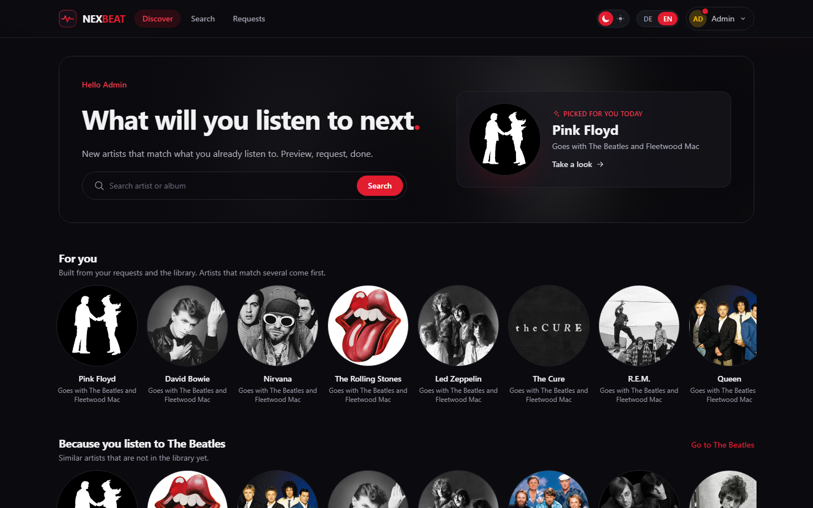
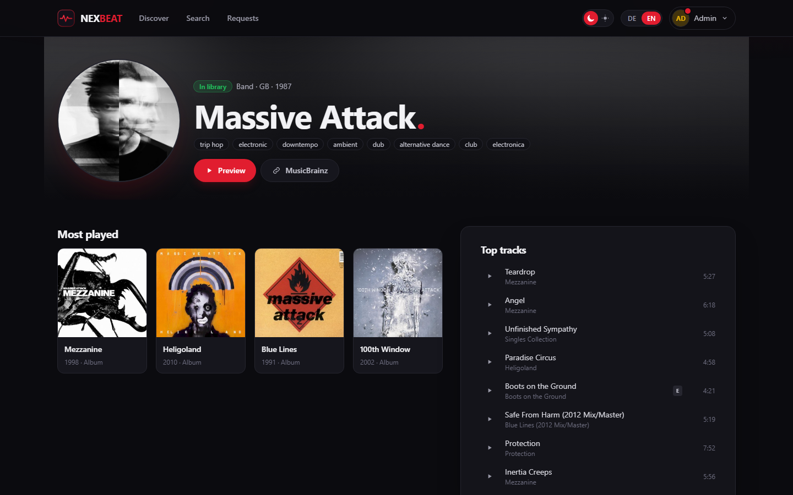
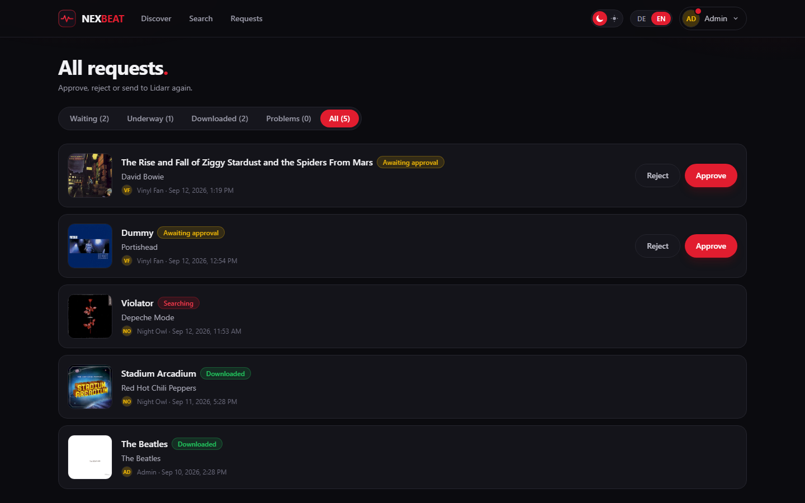

# nexbeat

Find music and request it from Lidarr with one click.



nexbeat is a small, self-hosted companion to Lidarr, built in the spirit of
[Nexview](https://github.com/DerKezorm/nexview): accounts with invitations,
per-user quotas counted by request, optional approval, and a discovery page
that recommends artists based on what the library and each user already have.

> **Status:** early. It runs against a real Lidarr, but it is a small side
> project: expect rough edges.

The screenshots show a throwaway instance with a few well-known artists as its
library.

## What it does

- **Discover:** "for you" and "because you listen to" rows from ListenBrainz
  similar-artist data, plus weekly trends. Artists already in Lidarr are left out.
- **Search** artists and releases in MusicBrainz, browse discographies and
  similar artists, listen to 30 second previews.
- **Request** a single album, EP or single. Unknown artists are added to Lidarr
  with only the requested album monitored.
- **Whole artists:** one request for every studio album and future ones. Only
  offered when the metadata profile keeps Lidarr to official studio albums.
- **Quotas** count requests per day, week or month. Rejected and failed
  requests do not count.
- **Accounts:** invitations and password reset by email, or as a link to pass
  on when no mail server is set up.

nexbeat never changes Lidarr settings. It adds and monitors artists and albums
and starts searches, nothing else.



## Running with Docker

```bash
mkdir nexbeat && cd nexbeat
curl -O https://raw.githubusercontent.com/DerKezorm/nexbeat/main/docker-compose.yml
docker compose up -d
```

Open `http://<your-host>:8030` and create the first account. It becomes the
administrator. Then, under **Settings**:

1. **Lidarr:** address, API key, root folder, quality and metadata profile. If
   users should be able to request whole artists, pick a metadata profile that
   allows official studio albums only. nexbeat checks this and says why when it
   does not fit.
2. **Mail** (optional): for invitations and password resets. Without a mail
   server, nexbeat hands out the links for you to pass on.
3. **Users:** invite people, set their quota and whether their requests need
   approval.

The Lidarr tab also shows a webhook address. Entered in Lidarr, it lets nexbeat
notice finished downloads right away; without it, nexbeat checks every two
minutes.

- **Updating:** `docker compose pull && docker compose up -d`
- **Backing up:** the whole data directory, the database and `secret.key`
  together. Without the key, the stored credentials cannot be read.
- **Images** are built for amd64 and arm64. `latest` follows releases, `main`
  the current development state.



## Run from source

```bash
cd backend
python -m venv .venv
.venv/Scripts/python.exe -m pip install -r requirements-dev.txt
.venv/Scripts/python.exe -m uvicorn app.main:app --port 8030
```

```bash
cd frontend
npm install
npm run dev
```

Open http://localhost:5182 and create the first account.

## Data sources

MusicBrainz, Cover Art Archive and ListenBrainz (open data). Artist images and
previews come from the public Deezer API and can be switched off.

## Licence

[GNU Affero General Public License v3.0](LICENSE).
